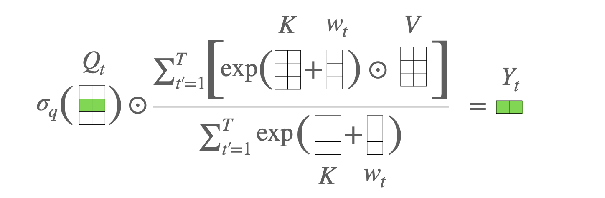
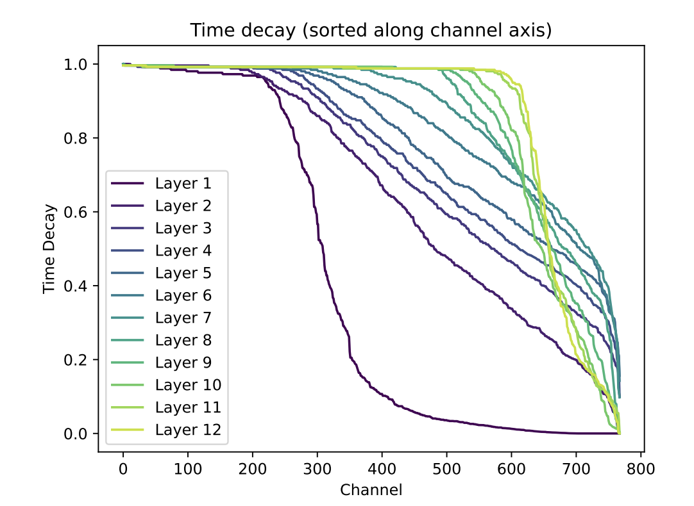
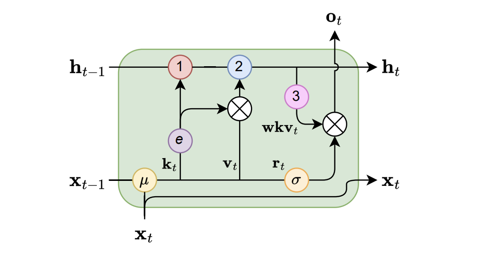
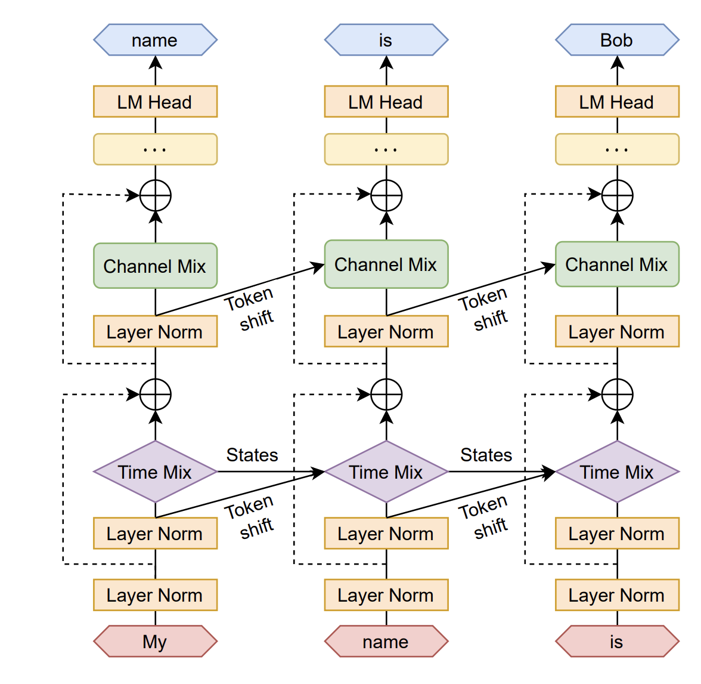
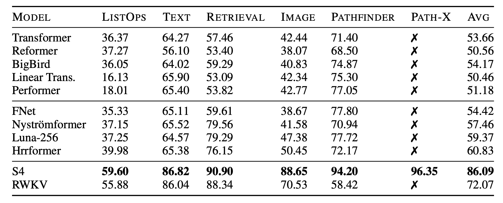
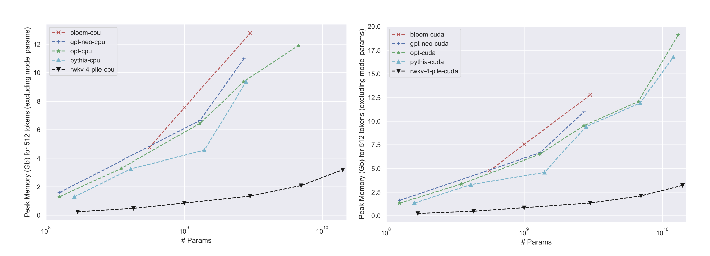

# [Linear Attention](https://arxiv.org/abs/2006.16236) Basics
In the [previous "boring" post](https://sergiudm.github.io/p/rwkv/), we discussed the traditional softmax attention mechanism and its limitations, particularly in terms of $O(n^2)$ computation cost during inference. We also reviewed the "age-old" RNNs, which have $O(n)$ computation cost but struggle to be trained in parallel.

Now, let's see something interesting: 
- Attention without softmax = RNN
- RNN with rank-1 hidden matrix and no reflection = Attention

**This is wild!!!**

## Dereivation
### attention -> RNN
Let's start with the softmax attention mechanism:
$$
\text{Attn}(t)=\sum_{i=1}^{n} \frac{\exp(\mathbf{q_t k_i^T})}{\sum_{j=1}^{n} \exp(\mathbf{q_t k_j^T})} \mathbf{v}_i = \text{softmax}(\mathbf{q}_t \mathbf{K}^T)\mathbf{V}
$$
(for simplicity, we omit the scalar $d_k$ in the attention formula)

Without `softmax`, we have:

$$
\text{'Attn'}(t)=\sum_{i=1}^{n} \frac{\mathbf{q_t k_i^T}}{\sum_{j=1}^{n} \mathbf{q_t k_j^T}} \mathbf{v}_i
=\frac{\mathbf{q}_t\sum_{i=1}^{n}\mathbf{k}_i^T\mathbf{v}_i}{\mathbf{q}_t\sum_{j=1}^{n} \mathbf{k}_j^T}
$$

Let 
$$\mathbf{S}_t=\sum_{i=1}^{n-1}\mathbf{k}_i^T\mathbf{v}_i$$ and 
$$\mathbf{Z}_t=\sum_{j=1}^{n-1} \mathbf{k}_j^T$$, we have:

$$
\begin{align*}
\mathbf{S}_t &= \mathbf{S}_{t-1} + \mathbf{k}_{t}^T\mathbf{v}_{t} \\
\mathbf{Z}_t &= \mathbf{Z}_{t-1} + \mathbf{k}_{t}^T \\
\mathbf{O}_t &=\frac{\mathbf{q}_t \mathbf{S}_t}{\mathbf{q}_t \mathbf{Z}_t} = \text{Attn}(t)
\end{align*}
$$

Which is a linear RNN!

### RNN -> attention
Now, let's start with a simple RNN:

$$
\mathbf{h}_t = \mathbf{h}_{t-1} \mathbf{W}_{h} + f_I(\mathbf{x}_t)
$$

$$
\mathbf{y}_t = f_O(\mathbf{h}_t)
$$

where $f(\mathbf{x}_t) = (\mathbf{x}_t \mathbf{W}_k)^T (\mathbf{x}_t \mathbf{W}_v) = \mathbf{k}_t^T \mathbf{v}_t \in \mathbb{R}^{d \times d}$ , $\mathbf{W}_h = \mathbf{I}$, and $f_O(\mathbf{h}_t) = \mathbf{q}_t \mathbf{h}_t = \mathbf{x}_t \mathbf{W}_q \mathbf{h}_t$.

Now, the hidden state is no longer a vector, but a $d \times d$ rank-1 matrix. Together with another hidden state $\mathbf{k}_t$, we can rewrite the RNN as:

$$
\mathbf{H}_t = \mathbf{H}_{t-1} + \mathbf{k}_t^T \mathbf{v}_t
$$

$$
\mathbf{O}_t = \mathbf{q}_t \mathbf{H}_t
$$

Unfolding the RNN, we have:

$$
\begin{align*}
\mathbf{O}_t 
&= \mathbf{q}_t (\mathbf{H}_{t-1} +  \mathbf{k}_t^T \mathbf{v}_t) \\
&= \mathbf{q}_t (\mathbf{H}_{t-2} +  \mathbf{k}_{t-1}^T \mathbf{v}_{t-1}) + \mathbf{q}_t \mathbf{k}_t^T \mathbf{v}_t \\
&= \mathbf{q}_t (\mathbf{H}_{t-3} +  \mathbf{k}_{t-2}^T \mathbf{v}_{t-2}) + \mathbf{q}_t \mathbf{k}_{t-1}^T \mathbf{v}_{t-1} + \mathbf{q}_t \mathbf{k}_t^T \mathbf{v}_t \\
&= \cdots \\
&= \sum_{i=1}^{t} \mathbf{q}_t \mathbf{k}_i^T \mathbf{v}_i
\end{align*}
$$

This is the attention output (linear combination of value vectors)!

## So what?
What an exciting result! It allows us to train our models in "attention" mode, and then switch to "RNN" mode for inference. But wait, there's more! Take a look at the "attention" formula:

$$
\text{Attn}(t)
=\frac{\mathbf{q}_t\sum_{i=1}^{n}\mathbf{k}_i^T\mathbf{v}_i}{\mathbf{q}_t\sum_{j=1}^{n} \mathbf{k}_j^T} = \frac{\mathbf{q}_t \mathbf{S}}{\mathbf{q}_t \mathbf{Z}}
$$

The terms  $$\mathbf{S}=\sum_{i=1}^{n}\mathbf{k}_i^T\mathbf{v}_i$$ and  $$\mathbf{Z}=\sum_{j=1}^{n} \mathbf{k}_j^T$$ are independent of $t$. Therefore we can pre-compute these terms and store them in a cache (in a sense of dynamic programming), allowing us to compute the attention output in $O(1)$ time at each time step. In this way, the total computation cost for processing a sequence of length $n$ is $O(n)$, which is much more efficient than the traditional `softmax` attention mechanism.

> Another view of this is that when we drop the `softmax`, instead of computing $(\mathbf{Q}\mathbf{K}^T)\mathbf{V}$, which takes $O(n^2d)$ multiplications, we compute $\mathbf{Q}(\mathbf{K}^T\mathbf{V})$, which takes $O(nd^2)$ multiplications.

>Spoiler: what if we have a causal mask? It's sad that we can no longer use the associativity of matrix multiplication with a causal mask. Therefore it's hard to parallelize the computation in time dimension. See the [next post](https://sergiudm.github.io/p/rwkv3/) for more details and a solution.

# Attention Free Transformer
Before we see the RWKV architecture, it's worth paying a glance at the [attention-free transformer](https://arxiv.org/abs/2105.14103) (AFT), since it provides insight into the RWKV architecture.

### AFT-Simple
Firstly, let's see the AFT-simple architecture:

$$
\mathbf{y}_t = \frac{\sigma_q(\mathbf{q}_t) \odot \sum_{j=1}^{n}\exp(\mathbf{K}_j)\odot \mathbf{v}_j}{\sum_{j=1}^{n} \exp(\mathbf{K}_j)}
$$

where $\sigma_q(\mathbf{q}_t)$ is a non-linear function(sigmoid as default) of the query vector $\mathbf{q}_t$, $\odot$ denotes element-wise multiplication, and the division is also element-wise.

With the knowledge of linear attention, now we can see that the values of $$\sum_{j=1}^{N}\exp(\mathbf{K}_j)\odot \mathbf{v}_j$$ and $$\sum_{j=1}^{N} \exp(\mathbf{K}_j) \in \mathbb{R}^d$$ are independent of $t$, thus can be cached to save computation cost. Furthermore, all operations are element-wise, the hidden state reduces to a vector, and the computation cost is $O(n)$.

The RNN form of AFT-Simple is:

$$
\mathbf{S}_t = \mathbf{S}_{t-1} + \exp(\mathbf{K}_t) \odot \mathbf{v}_t
$$

$$
\mathbf{Z}_t = \mathbf{Z}_{t-1} + \exp(\mathbf{K}_t)
$$

$$
\mathbf{y}_t = \sigma_q(\mathbf{q}_t) \odot \frac{\mathbf{S}_t}{\mathbf{Z}_t}
$$

### AFT-Full
AFT-Full introduces a learable "pair-wise position bias" to AFT-Simple:

$$
\mathbf{y}_t = \frac{\sigma_q(\mathbf{q}_t) \odot \sum_{j=1}^{n}\exp(\mathbf{K}_j+w_{t,j})\odot \mathbf{v}_j}{\sum_{j=1}^{n} \exp(\mathbf{K}_j+w_{t,j})}
$$

where $w_{t,j} \in \mathbb{R}$ is the learnable position bias for the $j$-th token at time step $t$. Together they form a $N \times N$ matrix. The interpretation of this is that 

$$
\exp(\mathbf K_j+w_{t,j})\odot \mathbf{v}_j=\exp(w_{t,j})\exp(\mathbf K_j)\odot \mathbf{v}_j
$$

. Therefore $w_{t,j}$ acts like an input gate for the $j$-th token at $t$.



Note that the AFT-Full architecture cannot be unfolded into a RNN, since the position bias $w_{t,j}$ is not independent of $t$. And the computation cost is still $O(n^2)$.

# RWKV v4
Finally, we are ready to see the RWKV v4 architecture. The RWKV v4 architecture looks similar to AFT-Full, but with a few key differences:

1. The position bias $w_{t,j}$ is replaced with a learnable "pair-wise position bias" $\mathbf{w}_{t,j} \in \mathbb{R}^{d}$, which is a vector instead of a scalar (each element is responsible for the entire sequence in a channel). 

2. To "circumvent any potential degradation of $\mathbf{W}$", the RWKV v4 architecture uses another vector $\mathbf{u}$ to attend to the "current" tokens (while the "past" tokens are governed by $\mathbf{W}$). This design will be seen clearly in the WKV operation.

## The `WKV` operation
For coherence, I skipped some important innovations in the RWKV v4 architecture, such as the "token-shift" operation; we will see them after the illustration of the `WKV` operation.
Now it's time to see the (causal) `WKV` operation, which is defined as:

$$
{wkv}_t  = \frac{\sum_{j=1}^{t-1}e^{-(t-1-j)w+k_j}\odot {v}_j+e^{u+k_t}\odot {v}_t}{\sum_{j=1}^{t-1}e^{-(t-1-j)w+k_j}+e^{u+k_t}}
$$

From the expression of the first term of the numerator, we can see that the $e^{k_j}$ is now affected by a decayed term $e^{-(t-1-j)w}$, which diminishes the influence of the "past" tokens as $j$ increases. 

This is a key difference from the AFT-Full architecture, where the position bias $w_{t,j}$ is independent of $j$. The second term of the numerator is the "current" token, which is governed by $\mathbf{u}$ and $\mathbf{W}$. The denominator is the sum of the two terms, which normalizes the output.
The WKV operation can be interpreted as a linear attention mechanism, where the "past" tokens are attended to with a decayed weight, and the "current" token is attended to with a learnable weight. This allows the model to learn more complex relationships between the tokens in the sequence.

>Question: What's the role of the decay term?

<div style="text-align: center;">
  
</div>

Written in RNN form, the WKV operation is:

$$
\begin{align*}
a_0, b_0 &= 0 \\
wkv_t &= \frac{a_{t-1} + e^{u+k_t}\odot v_t}{b_{t-1} + e^{u+k_t}} \\
a_t &= e^{-w}\odot a_{t-1} + e^{k_t}\odot v_t \\
b_t &= e^{-w}\odot b_{t-1} + e^{k_t} \\
\end{align*}
$$

Now it's easier to see the role of the decay term: it allows the model to learn a "forgetting" mechanism, which is similar to the forget gate in LSTMs. The decay term $e^{-w}$ diminishes the influence of the "past" tokens as $t$ increases, allowing the model to focus more on the "current" token.



However, $e^{k_t}$ can be large, and the above equation may cause overflow. To avoid this, we use a trick to constrain the values of the two "coefficients" to be in (0, 1]:

$$
\begin{align*}
q &:= \max(p_{t-1}, u + k_t), \\
wkv_t &= \frac{e^{p_{t-1}-q} \odot a'_{t-1} + e^{u+k_t-q} \odot v_t}{e^{p_{t-1}-q} \odot b'_{t-1} + e^{u+k_t-q}}
\end{align*}
$$

The same trick is applied to update $a_t$ and $b_t$:

$$
\begin{align*}
q' &:= \max(p_{t-1} - w, k_t), \\
a'_t &= e^{p_{t-1}-w-q'} \odot a'_{t-1} + e^{k_t-q'} \odot v_t, \\
b'_t &= e^{p_{t-1}-w-q'} \odot b'_{t-1} + e^{k_t-q'}, \\
p_t &= q'.
\end{align*}
$$

Since channels are independent, the above equation can be computed in parallel for each channel.
To see it clearly, let's dive into the official implementation of the WKV operation:

```C++
// RWKV v4 WKV operation (forward)
    /*
    dim3 threadsPerBlock( min(C, 32) ); 
    dim3 numBlocks(B * C / threadsPerBlock.x);
    kernel_forward<<<numBlocks, threadsPerBlock>>>(...);
    */
template <typename F>
__global__ void kernel_forward(const int B, const int T, const int C,
                             const F *__restrict__ const _w, const F *__restrict__ const _u, const F *__restrict__ const _k, const F *__restrict__ const _v,
                               F *__restrict__ const _y) {
    const int idx = blockIdx.x * blockDim.x + threadIdx.x;
    const int _b = idx / C;
    const int _c = idx % C;
    const int _offset = _b * T * C + _c;

    F u = _u[_c]; // channel-wise
    F w = _w[_c]; // channel-wise
    const F *__restrict__ const k = _k + _offset;
    const F *__restrict__ const v = _v + _offset;
    F *__restrict__ const y = _y + _offset;

    F p = 0, q = 0, o = MIN_VALUE;
    // p and q are running sums divided by exp(o) (to avoid overflows)
    for (int i = 0; i < T; i++) {
        // O(n) complexity
        const int ii = i * C;

        F no = max(o, u + k[ii]);
        F A = exp(o - no);
        F B = exp(u + k[ii] - no);
        y[ii] = (A * p + B * v[ii]) / (A * q + B);

        no = max(w + o, k[ii]);
        A = exp(w + o - no);
        B = exp(k[ii] - no);
        p = A * p + B * v[ii];
        q = A * q + B;
        o = no;
    }
}
```

After the WKV operation, an output gate $\sigma(r_t)$ is applied to the output of the WKV operation, where $\sigma$ stands for the sigmoid function, and $r_t$ is generated from the input token $\mathbf{x}$:

$$
o_t = W_o \cdot (\sigma(r_t) \odot wkv_t).
$$

This explains the name "RWKV".

## Token-shift
Another innovation in the RWKV v4 architecture is the "token-shift" operation, which acts like a "short convolution" interpolating two adjacent tokens. The token-shift operation is defined as:

$$
\begin{align*}
r_t &= W_r \cdot (\mu_r \odot x_t + (1 - \mu_r) \odot x_{t-1}), \\
k_t &= W_k \cdot (\mu_k \odot x_t + (1 - \mu_k) \odot x_{t-1}), \\
v_t &= W_v \cdot (\mu_v \odot x_t + (1 - \mu_v) \odot x_{t-1}),
\end{align*}
$$

Or in a unified form:

$$
\text{lerp}_{\square}(a, b) = a + (b - a) \odot \mu_{\square}
$$

Token shift tell the model how to treat new tokens by interpolating between the current and previous token representations. In essence, it can be viewed as a convolution with kernel size 2 (The FFN block in the transformer architecture can be viewed as a convolution with kernel size 1), which enhances the model's ability to capture local patterns in the sequence.

> Note:
> [Mamba](https://arxiv.org/abs/2312.00752) also proposed a similar idea, i.e., "causal conv1d", applied to the input embedding before the SSM block.

## Overall architecture
The overall architecture of RWKV v4 is shown below:

<div style="text-align: center;">
  
</div>

In which the "Time Mix" block is the rwkv operation, and the "Channel Mix" block is similar to the FFN block in the transformer architecture, yet equipped with token-shift as well.

$$
\begin{align*}
r'_t &= W'_r \cdot (\mu'_r \odot x_t + (1 - \mu'_r) \odot x_{t-1}), \\
k'_t &= W'_k \cdot (\mu'_k \odot x_t + (1 - \mu'_k) \odot x_{t-1}) \\
o'_t &= \sigma(r'_t) \odot (W'_v \cdot \max(k'_t, 0)^2),
\end{align*}
$$
where $\max(k'_t, 0)^2$ is the square of the ReLU activation of $k'_t$.

## Summary
In this post, we discussed the RWKV v4 architecture, which is a linear RNN that allows for efficient computation of attention outputs. We started by introducing the concept of linear attention and its relationship with RNNs. We then discussed the attention-free transformer architecture and its limitations. Finally, we introduced the RWKV v4 architecture, which incorporates several innovations such as the WKV operation, token-shift, and the overall architecture. It turns out that RWKV v4 works very well on long sequences. And it's memory efficient especially during inference.





## What's next?
- Hardware awareness
- Chunkwise parallelism
- Data dependent decay


