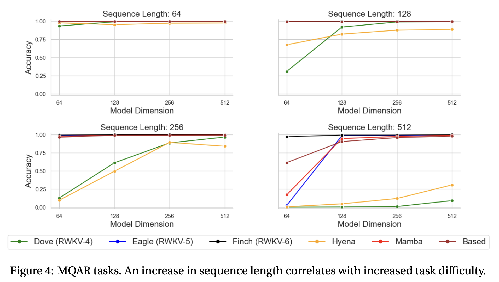
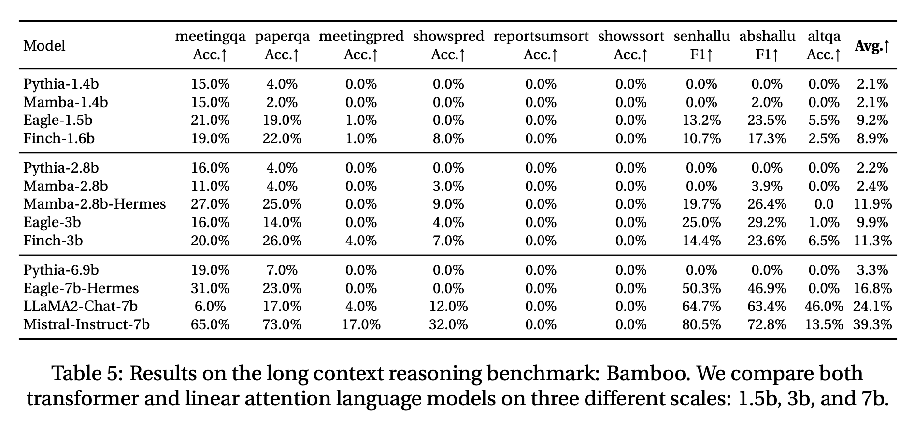
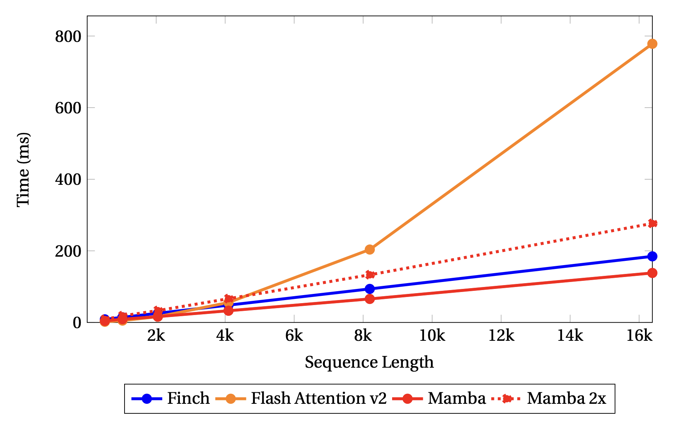
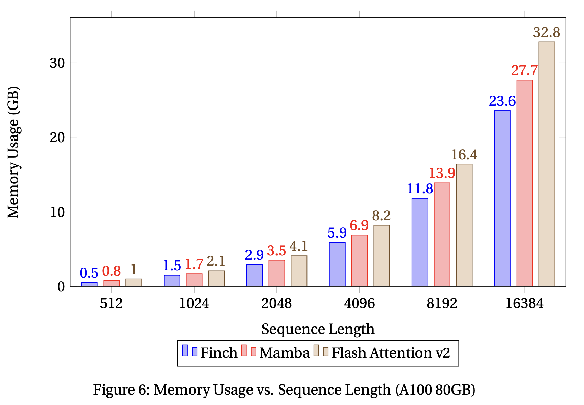

In the [previous blog](https://sergiudm.github.io/p/the-evolution-of-rwkv-part-2/), we've seen RWKV v4, where the core "Time Mixing" mechanism relied on a channel-wise update rule. In its recurrent form, the state update looked something like this:

$$wkv_t = \frac{\sum_{i=1}^{t-1} e^{-(t-1-i)w + k_i} \odot v_i + e^{u+k_t} \odot v_t}{\sum_{i=1}^{t-1} e^{-(t-1-i)w + k_i} + e^{u+k_t}}$$

Here, the decay $w$ and the keys/values ($k, v$) interact via **element-wise** operations ($\odot$). While elegant, this design compresses the entire history into a single vector $h \in \mathbb{R}^D$.

# The Hardware Lottery

Before we meet the architectural shift in RWKV v5, we must first understand the silicon soil in which these models grow. We live in the era where the winning algorithms are not necessarily the most theoretically elegant, but the ones that best **align with the idiosyncrasies** of modern hardware.

Speek in a "deep learning" way, the **Tensor Core** is king.

## The Specialized Beast
Modern GPUs (like the NVIDIA A100 or H100) are not merely collections of generic calculators. They possess specialized execution units known as Tensor Cores, designed for one specific purpose: **Dense Matrix Multiplication.**

While a standard **CUDA Core** operates on scalars—calculating a single multiplication and addition $(a \times b) + c$ per clock cycle—a Tensor Core operates on entire matrices at once. Specifically, it performs a fused multiply-add (FMA) on $4 \times 4$ matrices in a single operation:

$$D = A \times B + C$$

where $A, B, C, D$ are $4 \times 4$ matrices.

## The Magnitude of Efficiency
The performance gap is staggering. On an A100 GPU, half-precision (FP16) matrix multiplications running on Tensor Cores can be roughly **16 times faster** than those running on standard CUDA cores.

To achieve this throughput, the hardware demands specific data shapes and precision:
* **Data Layout:** The dimensions of the tensors must be divisible by specific multiples (e.g., 8 or 16) to align with the Tensor Core's tiling logic.
* **Precision:** These cores thrive on mixed precision (using FP16 or BF16 for multiplication while accumulating in FP32), sacrificing a sliver of accuracy for massive gains in throughput.

## The Vector Bottleneck
This is where RWKV-4 hit a wall. RWKV-4 was built on **vector-valued states**. Its core operations involved element-wise multiplications ($\odot$) between the decay vector $w$ and the state vector $h$:

$$h_t = w \odot h_{t-1} + k_t \odot v_t$$

Mathematically, this is sound. But architecturally, it is inefficient. Element-wise vector operations cannot be easily fused into the $4 \times 4$ matrix inputs required by Tensor Cores. They are relegated to the slower, general-purpose CUDA cores.

By adhering to vector states, RWKV-4 was essentially leaving the GPU's most powerful engine—the Tensor Core—idling. To unlock the next level of training speed and model capacity, RWKV-5 had to speak the language of matrices.

# RWKV v5 (Eagle)

Now there's **Eagle**. The leap from v4 to v5 was the transition from **Vector States** to **Matrix States**. Instead of compressing history into a vector, Eagle unfolds the memory into a collection of matrices.

## RNN Form
In Eagle, the hidden state $S_t$ becomes a matrix (specifically, one matrix per head). The update rule evolves from element-wise multiplication to the **outer product**:

$$S_t = \text{diag}(w) \cdot S_{t-1} + k_t^T v_t$$

Crucially, the term $k_t^T v_t$ creates a dense matrix that captures the pairwise interactions between *all* key features and *all* value features. This explodes the memory capacity from $O(D)$ to $O(D^2/H)$ without sacrificing the $O(1)$ inference speed.

## The Parallel Form
For training, like RWKV v4, it can be parallelized efficiently as well. The "receptance" $r$ (acting like a Query) retrieves information from this decaying matrix history:

$$wkv_t = \text{diag}(u) \cdot k_t^T \cdot v_t + \sum_{i=1}^{t-1} \text{diag}(w)^{t-1-i} \cdot k_i^T \cdot v_i$$

This formulation allows the model to utilize Tensor Cores effectively, aligning mathematical expressivity with hardware reality.

### Official WKV5 Forward [Kernel](https://github.com/BlinkDL/RWKV-LM/blob/main/RWKV-v5/cuda/wkv5_cuda.cu)

```cpp
template <typename F>
__global__ void kernel_forward(const int B, const int T, const int C, const int H,
                               const F *__restrict__ const _r, const F *__restrict__ const _k, const F *__restrict__ const _v, const float *__restrict__ _w, const F *__restrict__ _u,
                               F *__restrict__ const _y)
{
    const int b = blockIdx.x / H;
    const int h = blockIdx.x % H;
    const int i = threadIdx.x;
    _w += h*_N_;
    _u += h*_N_;

    __shared__ float r[_N_], k[_N_], u[_N_], w[_N_];
    float state[_N_] = {0};

    __syncthreads();
    w[i] = _w[i];
    u[i] = float(_u[i]);
    __syncthreads();

    for (int t = b*T*C + h*_N_ + i; t < (b+1)*T*C + h*_N_ + i; t += C)
    {
        __syncthreads();
        r[i] = float(_r[t]);
        k[i] = float(_k[t]);
        __syncthreads();

        const float v = float(_v[t]);
        float y = 0;

        #pragma unroll
        for (int j = 0; j < _N_; j+=4)
        {
            const float4& r_ = (float4&)(r[j]);
            const float4& k_ = (float4&)(k[j]);
            const float4& w_ = (float4&)(w[j]);
            const float4& u_ = (float4&)(u[j]);
            float4& s = (float4&)(state[j]);
            float4 x;

            x.x = k_.x * v;
            x.y = k_.y * v;
            x.z = k_.z * v;
            x.w = k_.w * v;

            y += r_.x * (u_.x * x.x + s.x);
            y += r_.y * (u_.y * x.y + s.y);
            y += r_.z * (u_.z * x.z + s.z);
            y += r_.w * (u_.w * x.w + s.w);

            s.x = s.x * w_.x + x.x;
            s.y = s.y * w_.y + x.y;
            s.z = s.z * w_.z + x.z;
            s.w = s.w * w_.w + x.w;
        }
        _y[t] = F(y);
    }
}
```

# RWKV v6 (Finch)
Eagle was powerful, but it had a rigid heartbeat. The decay rate $w$ (how fast the model forgets old data) was a **learned parameter**, but it was **static** during inference.

$$w = \exp(-\exp(\omega))$$

Once the model was trained, $w$ was fixed. The model could not dynamically decide to "dump" its memory when the topic changed or "hold" onto a specific crucial detail for 10,000 tokens. It was like reading a book where you are forced to forget every page at the exact same speed, regardless of how interesting the plot is. A natural question is: Is there a way to **dynamically** set the decay $w$ *at every single time step* without exploding the parameter count? To achieve so, RWKV v6 utilizes **Low-Rank Adaptation (LoRA)** mechanisms inside the block.

The decay rate $w_t$ is no longer a fixed value. Instead, it's now a function of the current input $x_t$:

$$w_t = \exp(-\exp(d_t))$$
$$d_t = \text{LoRA}_d(\text{ddlerp}_d(x_t, x_{t-1}))$$

Here, `ddlerp` is a data-dependent linear interpolation. The model can now look at the current token and say, "This is important, keep the memory," or "This is a new topic, wipe the slate clean".

## RNN Form
The state update equation in Finch becomes fully time-variant:

$$S_t = \text{diag}(w_t) \cdot S_{t-1} + k_t^T v_t$$

This simple change—making $w$ into $w_t$—allows for "selective forgetting," a capability previously exclusive to gated architectures like LSTMs or Mamba, but now available in the RWKV linear attention framework.

### Official WKV6 Forward [Kernel](https://github.com/BlinkDL/RWKV-LM/blob/main/RWKV-v5/cuda/wkv5_cuda.cu)

```cpp
template <typename F>
__global__ void kernel_forward(const int B, const int T, const int C, const int H,
                               const F *__restrict__ const _r, const F *__restrict__ const _k, const F *__restrict__ const _v, const F *__restrict__ _w, const F *__restrict__ _u,
                               F *__restrict__ const _y)
{
    const int b = blockIdx.x / H;
    const int h = blockIdx.x % H;
    const int i = threadIdx.x;
    _u += h*_N_;

    __shared__ float r[_N_], k[_N_], u[_N_], w[_N_];
    float state[_N_] = {0};

    __syncthreads();
    u[i] = float(_u[i]);
    __syncthreads();

    for (int t = b*T*C + h*_N_ + i; t < (b+1)*T*C + h*_N_ + i; t += C)
    {
        __syncthreads();
        w[i] = __expf(-__expf(float(_w[t]))); // data dependent decay!
        r[i] = float(_r[t]);
        k[i] = float(_k[t]);
        __syncthreads();

        const float v = float(_v[t]);
        float y = 0;

        #pragma unroll
        for (int j = 0; j < _N_; j+=4)
        {
            const float4& r_ = (float4&)(r[j]);
            const float4& k_ = (float4&)(k[j]);
            const float4& w_ = (float4&)(w[j]);
            const float4& u_ = (float4&)(u[j]);
            float4& s = (float4&)(state[j]);
            float4 x;

            x.x = k_.x * v;
            x.y = k_.y * v;
            x.z = k_.z * v;
            x.w = k_.w * v;

            y += r_.x * (u_.x * x.x + s.x);
            y += r_.y * (u_.y * x.y + s.y);
            y += r_.z * (u_.z * x.z + s.z);
            y += r_.w * (u_.w * x.w + s.w);

            s.x = s.x * w_.x + x.x;
            s.y = s.y * w_.y + x.y;
            s.z = s.z * w_.z + x.z;
            s.w = s.w * w_.w + x.w;
        }
        _y[t] = F(y);
    }
}
```

# Experimental Results

* **Recall Mastery:** On the **Multi-Query Associative Recall (MQAR)** task—a torture test for memory—RWKV-4 (Vector) struggled as sequences grew. RWKV-6, with its dynamic matrix memory, achieved near-perfect accuracy, outperforming even Mamba and Hyena.

<div style="text-align: center;">
  
</div>
    
* **Long-Context Reasoning:** In the **Bamboo Benchmark** (long-context reasoning), both RWKV v5/6 outperformed vanilla Mamba by notable margins, proving that the matrix state is superior at holding long-range dependencies.

<div style="text-align: center;">
  
</div>

* **Speed and Memory Superiority:** According to their [paper](https://arxiv.org/abs/2404.05892), RWKV v6 is significantly faster than Flash Attention for sequence lengths beyond 4k, being around 4.2x faster for a sequence length of 16k. Furthermore, It consistently outperforms Mamba and Flash Attention in terms of memory usage, using 40% and 17% less memory usage than Flash Attention and Mamba respectively.

<div style="text-align: center;">
  
</div>

<div style="text-align: center;">
  
</div>

# Summary

1.  **RWKV-4:** Proved linear attention could compete, but was constrained by **Vector States** (diagonal limitations).
2.  **RWKV-5:** Unfolded the memory into **Matrix States** ($k^T v$), unlocking massive capacity and Tensor Core efficiency.
3.  **RWKV-6:** Granted the model **Dynamic Recurrence** ($w_t$), allowing it to adaptively forget and remember based on context.

# What's next?
In the next blog, we will enter a whole new era, where we view linear attention as fast weight programmers. See [RWKV v7](https://sergiudm.github.io/p/the-evolution-of-rwkv-part-4/).