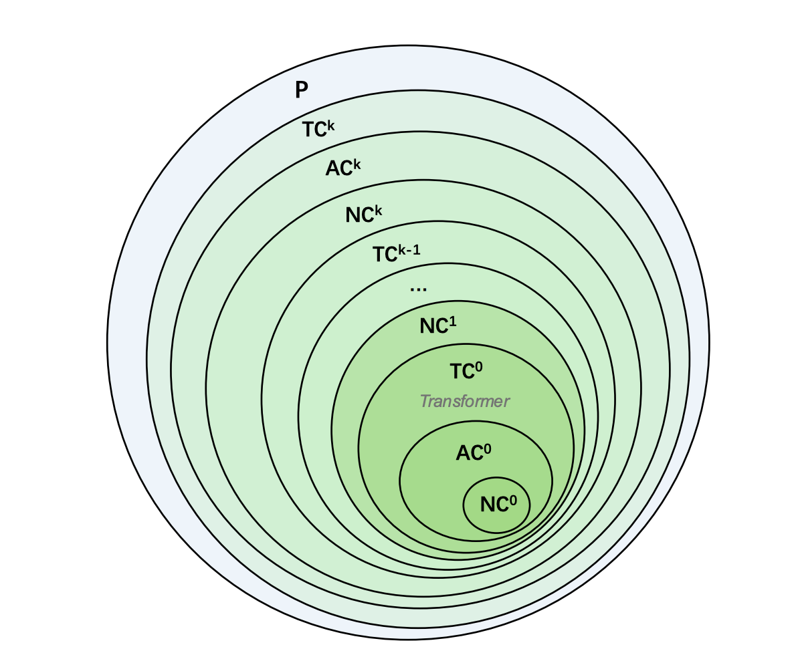

In the last three parts of our journey, we solved the parallelism problem with v4's time-shift, enriched the model's memory with v5's matrix-valued states, and made that memory context-aware with v6's dynamic decay. Each step made the model faster and smarter.

But a fundamental question lurked beneath the surface, a question that haunted all linear-style attention models. The state update in RWKV-4/5/6, at its core, was **additive**. At each step, we added new information (`k*v`) and applied a decay `w` to the entire state.

Think of the model's memory as a bucket of water. Each new token is a scoop of colored dye. The decay `w` is like some of the water evaporating, but the colors that are already mixed in stay mixed. Over time, the bucket becomes a muddy, indistinct brown. There was no way to reach in and remove *just the red dye* that was added 100 steps ago. This "muddying" effect limits how cleanly a model can handle long, complex sequences with distinct pieces of information.

The RWKV-7 research solves this by revitalizing a classic idea in machine learning for the modern age: the **Delta Rule**. This is the story of RWKV-7 "Goose"—the leap from an additive memory to a truly updatable, *mutable* state, and the profound theoretical power that this unlocks.

## From Adding to Updating: The Delta Rule

The traditional state update in linear attention can be seen as:

$$
S_t = S_{t-1} + v_t^T k_t
$$

Here, the state $\mathbf{S}$ (a matrix in RWKV-5+) simply accumulates the outer products of keys and values.

The **Delta Rule**, first proposed by Widrow and Hoff in 1960, frames this differently. It sees the state $\mathbf{S}$ as a set of weights for an online learning problem. The goal is to update $\mathbf{S}$ so that when queried with a key $\mathbf{k}$, it produces the corresponding value $\mathbf{v}$. When a new $(\mathbf{k_t}, \mathbf{v_t})$ pair arrives, we update the state to correct the error on this new example. This update rule, for a single step of gradient descent, is:

$$
S_t = S_{t-1}(I - \alpha k_t^T k_t) + \alpha v_t^T k_t
$$

Let's break this down:

*   **$S_{t-1}(I - \alpha k_t^T k_t)$:** This is the "erase" step. We take the old state $S_{t-1}$ and subtract a portion $\alpha$ of the information it holds specifically at the address $k_t$.
*   **$+ \alpha v_t^T k_t$:** This is the "write" step. We add the new information $v_t$ at the address $k_t$.

Instead of just adding, the Delta Rule allows the model to **partially replace** old information with new information at a specific key. It can finally take the red dye out of the bucket. This is the conceptual heart of RWKV-7.

## Generalized Delta Rule

RWKV-7 takes this core idea and supercharges it. The full state evolution looks like this:

$$
S_t = S_{t-1} G_t + v_t^T k_t
$$

Let's dissect this. The new $(\mathbf{k_t}, \mathbf{v_t})$ pair is added, but the most interesting part is the **state transition matrix $\mathbf{G}_t$**, which is applied to the old state $\mathbf{S}_{t-1}$.

$\mathbf{G}_t$ has a special structure called **Diagonal Plus Low-Rank (DPLR)**:

$$
\mathbf{G}_t = \text{diag}(w_t) - \kappa_t^T (\mathbf{a_t} \circ \kappa_t)
$$

This formula is the engine of RWKV-7. Let's examine its two components:

1.  **$\text{diag}(w_t)$ (The Diagonal Part):** This is the **per-channel decay** we saw in RWKV-6. It's a diagonal matrix, meaning it applies a separate, data-dependent decay $w_t$ to each feature channel (i.e., each column of the state matrix $\mathbf{S}$). This is our "evaporation" or "forgetting" over time.

2.  **$- \kappa_t^T (\mathbf{a_t} \circ \kappa_t)$ (The Low-Rank Part):** This is our powerful new "replace" mechanism, derived from the Delta Rule. It's a rank-1 matrix, which is computationally cheap.
    *   **$\kappa_t$** is the **removal key**. This vector specifies *what information to remove* from the state. Crucially, in RWKV-7, this is **decoupled** from the replacement key $\mathbf{k}_t$. The model can choose to remove information associated with one concept while writing information about another.
    *   **$\mathbf{a_t}$** is the **vector-valued in-context learning rate**. This is a vector of values between 0 and 1 that controls *how much* to remove at each channel. It's also data-dependent. This gives the model fine-grained, per-channel control over the update intensity.

So, at every time step, RWKV-7 performs a sophisticated update:
1.  It decays the entire memory state $\mathbf{S}_{t-1}$ using the dynamic $\mathbf{w_t}$.
2.  It surgically removes specific information located at the "address" $\kappa_t$, with an intensity controlled by $\mathbf{a_t}$.
3.  It then writes new information $\mathbf{v_t}$ at a separate "address" $\mathbf{k_t}$.

This gives the model a flexible, internal scratchpad that it can modify as it processes a sequence.

### CUDA Kernel (forward)
```cpp
__global__ void forward_kernel(int T, int H, F_ w_, F_ q_, F_ k_, F_ v_, F_ a_, F_ b_, bf* y_, float* s_, float* sa_) {
    constexpr int C = _C_;
    int bb = blockIdx.y, hh = blockIdx.x, i = threadIdx.x;

    float state[C] = {0};
    __shared__ float q[C], k[C], w[C], a[C], b[C];

    for (int t = 0; t < T; t++) {
        int ind = bb*T*H*C + t*H*C + hh * C + i;
        __syncthreads();
        q[i] = to_float(q_[ind]);
        w[i] = __expf(-__expf(to_float(w_[ind])));
        k[i] = to_float(k_[ind]);
        a[i] = to_float(a_[ind]);
        b[i] = to_float(b_[ind]);
        __syncthreads();

        float sa = 0;
#pragma unroll
        for (int j = 0; j < C; j++) {
            sa += a[j] * state[j];
        }
        sa_[ind] = sa;

        float v = to_float(v_[ind]);
        float y = 0;
#pragma unroll
        for (int j = 0; j < C; j++) {
            float& s = state[j];
            s = s * w[j] + sa * b[j] + k[j] * v;
            y += s * q[j];
        }
        y_[ind] = to_bf(y);

        if ((t+1)%_CHUNK_LEN_ == 0) {
            int base = (bb*H+hh)*(T/_CHUNK_LEN_)*C*C + (t/_CHUNK_LEN_)*C*C + i;
#pragma unroll
            for (int j = 0; j < C; j++) {
                s_[base + j*C] = state[j];
            }
        }
    }
}
```

## A Layman's Guide to Expressivity: Why This Matters

So, we have a more complex formula. But what does it actually *buy* us? The answer lies in the esoteric-sounding but deeply important field of **computational complexity theory**. The question is: What class of problems can a model architecture *fundamentally compute*?

**The Transformer's Limit: $TC^0$ and the Immutable State**

Think of a single layer of a neural network as a computational circuit. For a fixed input length, a Transformer's attention mechanism can be unrolled into a circuit of logic gates. Researchers have shown that this circuit belongs to a complexity class called **$TC^0$**.

*   **What is $TC^0$?** It's the class of problems solvable by circuits with a **constant depth** (no matter how long the input is) and polynomial size, using threshold gates (e.g., "fire if more than 50% of inputs are active").
*   **The Good:** This is why Transformers are so parallelizable! A constant-depth circuit can be evaluated extremely quickly.
*   **The Bad:** This is also a fundamental limitation. There are many "simple" problems that are believed to be impossible to solve in $TC^0$, because they require sequential logic.

<div style="text-align: center;">
  
</div>

The core reason for this limitation is that a Transformer's state—the Key-Value (KV) cache—is **immutable**. It's an append-only log. When the model processes token #100, it cannot go back and change what it stored for token #5. It can only choose to *attend* to it or not.

**RWKV-7's Power: $NC^1$ and the Mutable State**

RWKV-7 breaks this barrier. Its state $S_t$ is **mutable**. The DPLR update rule allows it to fundamentally rewrite its own memory at each step.

Let's use a simple example to see why this is so powerful: **The Swap Problem**.

> Imagine I give you a list of five items, `[A, B, C, D, E]`, and then a series of instructions:
>
> 1.  Swap the item in position 1 with the item in position 3. (Now `[C, B, A, D, E]`)
> 2.  Swap the item in position 2 with the item in position 5. (Now `[C, E, A, D, B]`)
>
> What is the final order?

A Transformer would find this very difficult. It has to indirectly reason about the changing positions through its attention patterns. An RWKV-7 model, however, can solve this directly. It can initialize its state matrix to be the identity matrix. Each swap instruction causes it to construct a **permutation matrix** (which is a DPLR matrix!) and multiply its current state by it. The final state matrix *is* the permutation that describes the final ordering.

This problem is known to be in a higher complexity class called **$NC^1$** (problems solvable by logarithmic-depth circuits), which is strongly believed to be more powerful than $TC^0$. By solving this, RWKV-7 proves it is fundamentally more expressive than a Transformer.

## The Punchline: Recognizing Any Regular Language

This theoretical power has a stunning consequence, proven in the RWKV-7 paper:

> **RWKV-7 can recognize any regular language with a constant number of layers.**

A **regular language** is any language that can be described by a **Deterministic Finite Automaton (DFA)**—a simple state machine. Think about validating an email address, parsing a simple log file, or tracking the state of a game. These are all regular languages.

The ability to simulate *any* DFA means RWKV-7 has the theoretical machinery to perfectly track finite states and recognize rule-based patterns, a task essential for logical reasoning and structured data understanding. Classical RNNs could theoretically do this, but suffered from vanishing gradients and couldn't be trained in parallel. Transformers fundamentally cannot. RWKV-7 is the first architecture to achieve this theoretical power while retaining the parallel training and efficient inference of the RWKV family.

This isn't just a theoretical curiosity. This newfound expressive power, born from the mathematics of the generalized delta rule, is what fuels the state-of-the-art performance we see from RWKV-7 on benchmarks. The theory finally explains the performance, bridging the gap between abstract formulas and real-world results.

## Deeper Insight: RWKV-7 as a Fast Weight Programmer

This ability to simulate a state machine is a powerful result, but it's a symptom of an even deeper principle at play. RWKV-7 isn't just a state machine; it's a form of **programmable computer**. To understand this, we need to introduce the concept of **Fast Weight Programming**.

In a typical neural network, the "weights" (or parameters) are learned slowly over a massive dataset through gradient descent. We can call these **slow weights**. The idea of a "fast weight programmer," pioneered by Jürgen Schmidhuber, is that a network can also have a second set of weights—**fast weights**—that are rapidly modified *within a single forward pass*. These fast weights are stored in the network's hidden states and act as a temporary, context-specific program.

This is exactly what RWKV-7 does. The state matrix $\mathbf{S}_t$ *is* the set of fast weights. It represents a temporary linear model that is constructed and modified on the fly. The key insight is this: **the state update is not an arbitrary rule, but an implementation of online gradient descent on these fast weights.**

### The Gradient Descent of Fast Weights

Let's derive this from first principles. Imagine the state matrix $\mathbf{S}_{t-1}$ is our current "program" or internal model. Its job is to map keys to values. When the next token arrives, it gives us a new target mapping: the key $\mathbf{k}_t$ should map to the value $\mathbf{v}_t$.

How well does our current program $\mathbf{S}_{t-1}$ perform on this new task? We can measure the error with a simple loss function, the squared error:

$$
\mathcal{L}(\mathbf{S}_{t-1}) = \frac{1}{2} || \mathbf{S}_{t-1}^T \mathbf{k}_t - \mathbf{v}_t ||_2^2
$$

Our goal is to update our program from $\mathbf{S}_{t-1}$ to $\mathbf{S}_t$ by taking a single step of gradient descent to reduce this error. The standard gradient descent update rule is:

$$
\text{New Weights} = \text{Old Weights} - (\text{learning rate}) \times \nabla_{\text{Old Weights}} \mathcal{L}
$$

In our case, the "weights" are the fast weights in the matrix 
$\mathbf{S}_{t-1}$.

Let's find the gradient of our loss function with respect to $\mathbf{S}_{t-1}$:

$$
\nabla_{\mathbf{S}} \mathcal{L} = (\mathbf{S}_{t-1}^T \mathbf{k}_t - \mathbf{v}_t) \mathbf{k}_t^T
$$

Now, we plug this gradient into our update rule. Let's use $\alpha$ as our scalar learning rate:

$$
\mathbf{S}_t = \mathbf{S}_{t-1} - \alpha \left( (\mathbf{S}_{t-1}^T \mathbf{k}_t - \mathbf{v}_t) \mathbf{k}_t^T \right)^T
$$
$$
\mathbf{S}_t = \mathbf{S}_{t-1} - \alpha \mathbf{k}_t (\mathbf{k}_t^T \mathbf{S}_{t-1} - \mathbf{v}_t^T)
$$

Rearranging the terms, we get:

$$
\mathbf{S}_t = \mathbf{S}_{t-1} - \alpha \mathbf{k}_t \mathbf{k}_t^T \mathbf{S}_{t-1} + \alpha \mathbf{k}_t \mathbf{v}_t^T
$$

Factoring out $\mathbf{S}_{t-1}$ on the right, we arrive at a familiar formula:

$$
\mathbf{S}_t = (I - \alpha \mathbf{k}_t \mathbf{k}_t^T) \mathbf{S}_{t-1} + \alpha \mathbf{v}_t \mathbf{k}_t^T
$$

This is precisely the **Delta Rule**. The "erase" and "write" operations are not just an intuitive idea; they are the direct mathematical consequence of performing one step of gradient descent on the fast weights to learn the new key-value association.

### From Delta Rule to RWKV-7's Full Power

RWKV-7 takes this foundational principle and generalizes it for maximum expressivity:

1.  **Global Forgetting:** It introduces the per-channel decay `diag(w_t)`, combining the gradient descent update with a mechanism to forget information globally over time.
2.  **Vector-Valued Learning Rate:** The scalar learning rate $\alpha$ is promoted to a data-dependent *vector* $\mathbf{a}_t$. This allows the model to learn *how much to update* for each feature channel independently.
3.  **Decoupled Keys:** The key used for calculating the error gradient (the "erase" key, $\kappa_t$) is decoupled from the key used for the value to be written ($\mathbf{k}_t$). This adds another layer of flexibility.

Combining these gives us the full RWKV-7 state transition matrix $\mathbf{G}_t = \text{diag}(\mathbf{w}_t) - \kappa_t^T (\mathbf{a}_t \circ \kappa_t)$.

This re-framing is critical. A Transformer learns a static function for processing data. RWKV-7 learns a **learning algorithm** (the slow weights) that it then executes during the forward pass to rapidly program a temporary, specialized linear model (the fast weights) perfectly adapted to the immediate context. It is a model that learns how to learn, and this meta-learning capability, derived from the mathematics of online gradient descent, is the ultimate source of its power and expressivity.