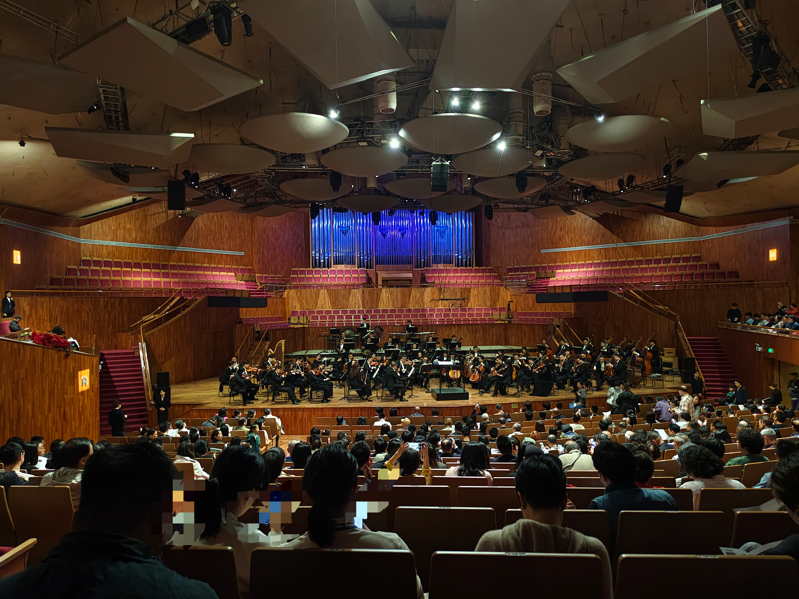
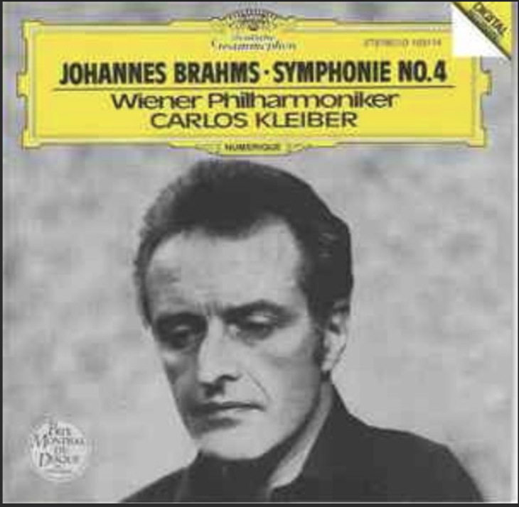
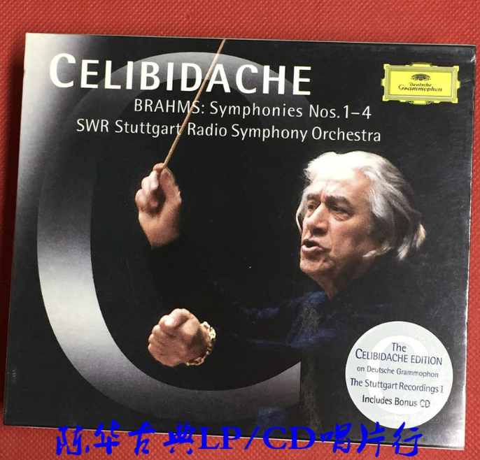
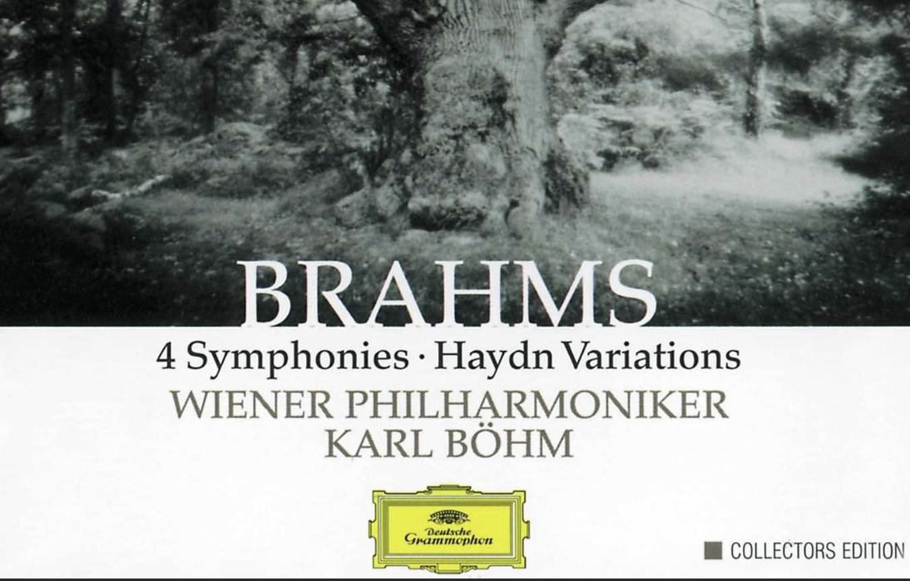

# 2025广交勃四记录
## 曲目
- 穆索尔斯基《纤夫之歌》
- 普罗科菲耶夫《第二号小提琴协奏曲》
- 勃拉姆斯《第四交响曲》

## 指挥
余隆指挥广交

## 演出

只能说，这场勃四最大的惊喜是勃四前的普二小协。普二小协的演奏非常好，尤其是定音鼓，和小提合一起一高一低的相互对比，简直是神中神。

然后是勃四。可能是我听Celibidache的版本太频繁了，习惯了慢节奏，这第一乐章几个音一出来就觉得太快了。尤其是第一主题副部，简直要飞起来。第二乐章更是，不知道搞那么快干嘛。有些地方甚至圆号还跟不上，就难评。第三乐章倒是挺精彩的，感觉还是靠定音鼓大神带起来的。最后一乐章，还是快，而且不知道是不是因为我坐的地方刚好在二层甲板的下面，整个木管的声部都听不太清楚。但除此之外，弦乐的发挥还是不错的，尤其是大提的音色，真的太好听了，几次被震撼到。

## 个人感受
这是我第一次听勃四，之前只听过勃四的录音。我听过的版本有：
- 小克指挥维爱（1981）

- [切利1986东京](https://www.bilibili.com/video/BV125411W7Qa/?spm_id_from=333.337.search-card.all.click&vd_source=c9aa7a5d8a8023cdf584d2e6e030aa68)（这个真的太喜欢了，第二乐章反复听）

- 伯姆指挥维爱

- [斯托科夫斯基指挥新爱](https://www.bilibili.com/video/BV1Jt4y1C7N9/?spm_id_from=333.337.search-card.all.click&vd_source=c9aa7a5d8a8023cdf584d2e6e030aa68)（哈哈哈，这个版本真有意思，最后一个乐章真畅快淋漓）

还有一些其他的版本，比如红卡和阿巴多，感觉都不错，但还是上面三个比较有特点，属于是非主流中的佼佼者了。
但我想说的是，这些录音再怎么好，还是比不上现场的。一个三角铁的音色，现场听到的和录音里听到的完全不一样。所以还是要多去听现场的音乐会，才能体会到交响曲的魅力。

（可是好像接下来的几个月深交和广交都没有我喜欢的曲目了，哎）