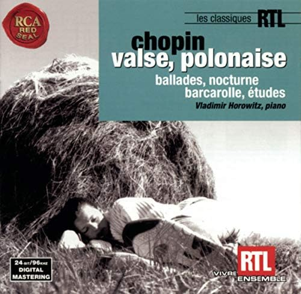
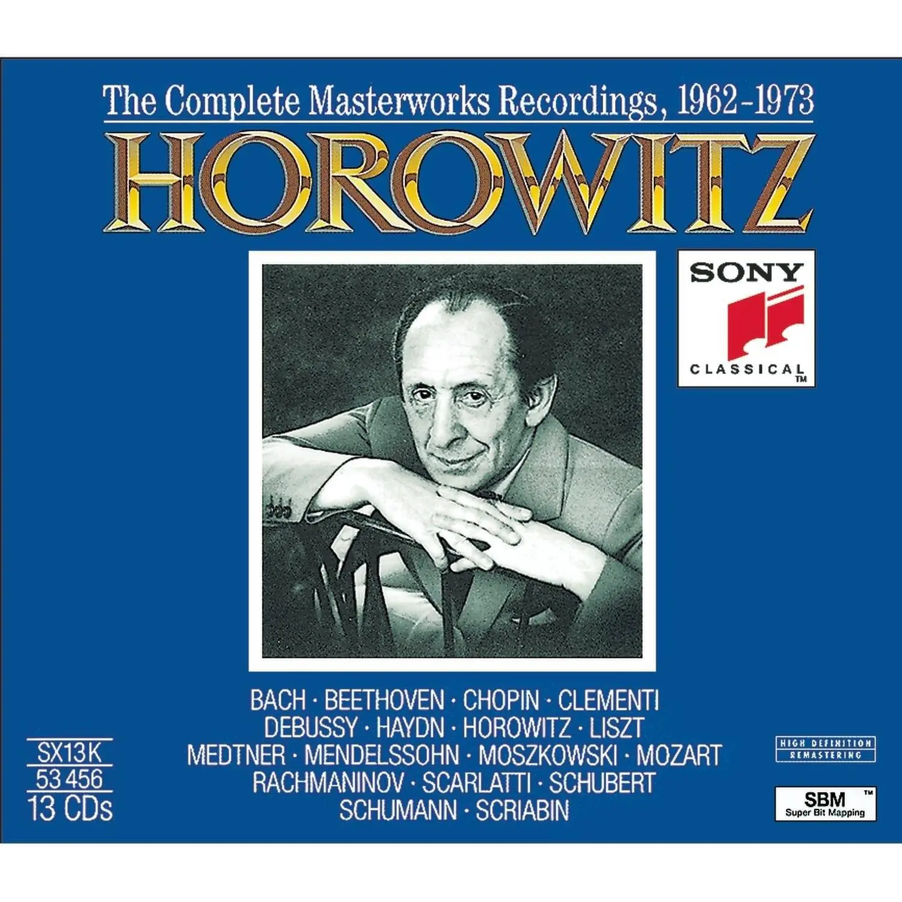

俄罗斯的演奏大师有很多，包括 Vladimir Horowitz、David Oistrakh、Mstislav Rostropovich 这些不同领域的神级演奏家。 就个人而言，也许是因为我更喜欢钢琴作品吧，霍老给我带来的震撼最大。 其实以前很早就听过大家说霍洛维兹弹的如何如何好，当时也没太在意，并没有特别关注他。直到最近听了他的肖邦船歌。

  

这船歌从第一个小节开始就和其他版本不太一样，比如左右手的节奏。 他的节
奏更加自由，左右手并没有完全对齐，但是却挥洒自如。而到了技巧性更强的部分，不同于很多演奏者尽其所能卖弄技术，霍老以一种淡定、飘然、举重若轻的风格跑动手指，这种淡定的感觉让我觉得他是在讲一个故事，而非展示自己的技巧。当时一听完，我突然就喜欢上肖邦的船歌了，于是又翻出了一些其他版本的船歌来听，但是后来逐渐发现，我喜欢的是完全是霍洛维茨的演奏，或者说，这首船歌太能体现他这种不同于一般钢琴家的气质了。

于是我又翻出了一些霍洛维兹的其他作品来听，终于发现了宝藏：

  

这张专收录了霍老从1962到1973（也就是六七十岁期间）的若干演奏，涵盖的曲目也很丰富，包括几首莫扎特和贝多芬的钢奏，舒曼的Kinderszenen全集，肖邦的玛祖卡、夜曲、叙事曲，李斯特的安慰曲等等，简直就是水桶专。而且，音质出乎意料的好！！
这里面的曲子，只能用“听到就爱上”来形容了。比如贝多芬的《月光》一。我敢打赌你没听到过这种弹法（我指的不是Glenn Gould的那种）。

一般提到霍老都喜欢说他的拉三，说他如何如何刚硬。但我觉得这样的刻板印象很可能让人们忽略他内在的气质。霍老并非单纯的“刚”，听听他的《波兰舞曲》就知道了，你能感受到他对旋律的理解，这不光是触键的问题，更多是一种个人气质的影响。这种气质形成了一种独特的美感，非常有辨识度。

当然，霍老的这种演奏风格也不一定适用于任何曲子。比如肖邦第一叙事曲，我个人就难以接受。但对于大多数曲子来说，如果你听“权威版本”听腻了，不妨试试霍老的版本，或许会有意外的收获。

